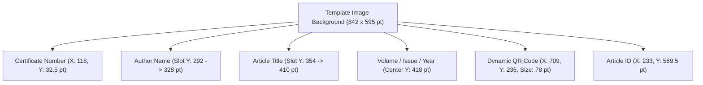

# Publication Certificate Template & Dynamic PDF Rendering Report

## Overview
This document details the refactoring and cleanup of the **Publication Certificate** generation pipeline for the **International Journal of Intelligent Digital Computing Research (IJIDCR)** published by **Asgard International Foundation for Research & Innovation**.

Previously, the PDF generation relied on hardcoded whiteout rectangles over a template image containing baked-in sample values (`Dr. Surendhar`, `ARFI-26-IJIDCR-26-00001`, `OPTIMIZATION OF DISTRIBUTED...`). This resulted in overlapping text, missing lines, and visual clipping.

The pipeline was redesigned to use a **clean raster template** (with all decorative lines, branding, and borders preserved) and a **precise dynamic PDFKit overlay engine**.

---

## 1. Clean Template Recreation

### Files Updated
- [`Journal-/client/templete.png`](file:///home/inkyank/Music/sep3jornal/Journal-/client/templete.png) (2339 × 1560 px, ~300 DPI)
- [`Journal-/server/src/assets/certificate-template.png`](file:///home/inkyank/Music/sep3jornal/Journal-/server/src/assets/certificate-template.png) (2339 × 1560 px, ~300 DPI)

### Elements Cleaned vs. Preserved

| Region | Baked-in Value Removed | Elements Preserved / Restored |
|---|---|---|
| **Top Left** | `ARFI-26-IJIDCR-26-00001` | Golden `CERTIFICATE NO:` label + background gradient |
| **Top Right** | *None* | `ISSN NO: 2654-6725` & Asgard International Publications Logo |
| **Author Card** | `Dr. Surendhar` | `This is to certify that` + White card area + **Golden Accent Underline** (`#C4A24C` at `Y: 845 px`) |
| **Title Band** | `OPTIMIZATION OF DISTRIBUTED...` (2 lines) | `has published a research paper entitled` + **Blue Ruled Lines** (`#BED0E4` at `Y: 960 px`, `1038 px`, `1116 px`) |
| **Metadata** | `1`, `1`, `2026` sample numbers | Clean background for dynamic `in Volume X, Issue Y, Year Z` rendering |
| **Verification** | Dummy QR matrix pattern | Golden QR Border Frame + `SCAN TO VERIFY` + `www.ijidcr-asgard.in/Verify` |
| **Signatures** | *None* | Dr. M. Sulthan Ibrahim (Editor-in-Chief) & Dr. Dinesh Senduraja (Director) signatures and titles |
| **Bottom Ribbon** | `IJIDCR-26-00001` | Golden `ARTICLE ID:` label + Globe icon + `www.ijidcr-asgard.in` |

---

## 2. Dynamic PDFKit Overlay Pipeline

### File Updated
- [`Journal-/server/src/modules/publications/certificate.renderer.js`](file:///home/inkyank/Music/sep3jornal/Journal-/server/src/modules/publications/certificate.renderer.js)

### Coordinate & Typography Reference (A4 Landscape: 842 × 595 pt)

### Exact Coordinates

1. **Certificate Number**:
   - `Font`: `Helvetica-Bold`, `8.5 pt`
   - `Color`: Navy (`#0B1B3A`)
   - `Position`: `X: 118 pt, Y: 32.5 pt` (aligned with the static `CERTIFICATE NO:` label).

2. **Author Name**:
   - `Font`: `Times-BoldItalic`, `22 pt` (auto-shrinks down to `13 pt` for longer names)
   - `Color`: Navy (`#0B1B3A`)
   - `Slot`: Centered within `Y: 292 -> 328 pt`, sitting above the golden accent line.

3. **Article Title**:
   - `Font`: `Times-Bold`, `13.5 pt` (auto-fit up to 3 lines)
   - `Color`: Navy (`#0B1B3A`)
   - `Slot`: Centered within `Y: 354 -> 410 pt`, bounded by the horizontal blue ruled lines.
   - **No quotation marks** are wrapped around the title text.

4. **Volume, Issue, Year**:
   - `Font`: `Times-Roman`, `11 pt`
   - `Color`: Navy (`#0B1B3A`)
   - `Position`: Centered horizontally at `Y: 418 pt` with underlined value slots (`in Volume ___1___, Issue ___1___, Year ___2026___`).
   - Each value is centered within a `55 pt` underline slot drawn with a `0.75 pt` navy stroke.

5. **Dynamic QR Code**:
   - `Dimension`: `78 × 78 pt`
   - `Position`: `X: 709 pt, Y: 236 pt` (centered inside the golden border box at the top-right).

6. **Article ID**:
   - `Font`: `Helvetica-Bold`, `8.5 pt`
   - `Color`: Navy (`#0B1B3A`)
   - `Position`: `X: 233 pt, Y: 569.5 pt` (aligned with the static `ARTICLE ID:` label on the bottom ribbon).

---

## 3. Verification & Testing

1. **Sample Certificate Regenerated**:
   - [`Journal-/Certificate-ARFI-26-IJIDCR-26-00004.pdf`](file:///home/inkyank/Music/sep3jornal/Journal-/Certificate-ARFI-26-IJIDCR-26-00004.pdf)
   - Tested both short single-line titles (`“CYBER-AI”`) and multi-line titles with co-authors.

2. **Unit Tests**:
   - Publication service test suite passed: `14 passed (14)`.
